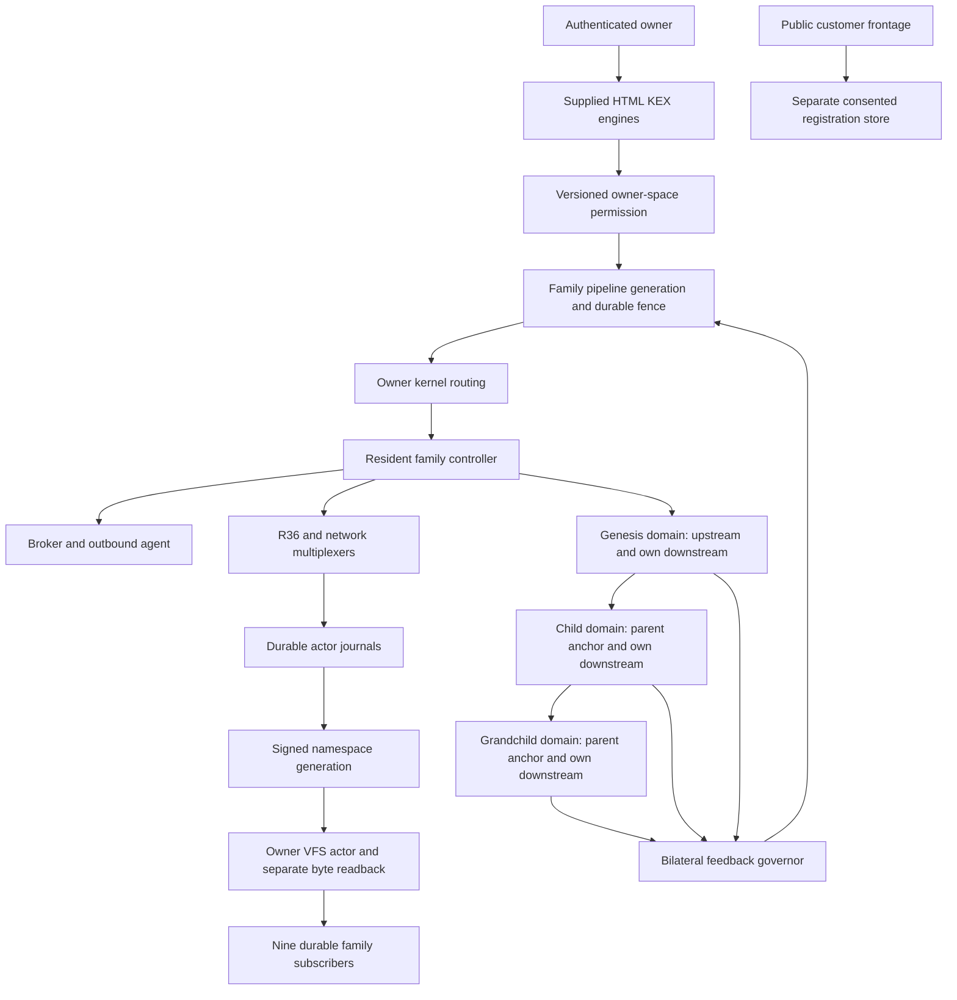

# Executable system architecture

Document authority: ARC-001 revision 1.0. Technical baseline: executable commit
`9ab5fd83c4e3e87e592885f00e912f2d8fe19233`, wheel 0.3.2, SHA-256
`5bbaad7c3d4c2dee231255eb183343674e48a6411f7ee007118c78b3dfffe71d`.
Evidence is local owner-operated execution; independent production assessment is unset.

## Purpose and architectural position

KEDDEH uses its supplied runtimes as the execution substrate. The package supplies
admission, lifecycle, network boundaries, durable state, user controls and evidence
around those runtimes. HTML carriers are executable resident surfaces rather than
merely explanatory diagrams. Their cloud controls use actual authenticated
services. Software model phase/feedback participates in runtime transactions;
physical energy or power generation has not been demonstrated.

The current scope is nine repository families on one cloud host. Repository code,
private owner source custody, local runtime state and public website publishing
are different planes with different authorities. Git push does not publish the
native public Site, create an off-site service or certify a deployment.

## Components and ownership

| Component | Function | State and boundary | Attributed implementation |
|---|---|---|---|
| KEX terminal | Browser command and peer mesh surface | Browser-local session; owner token held in memory | Exact admitted terminal HTML plus shared cloud bridge |
| HTML Linux carrier | Resident HTML execution surface | Browser-local; shared owner control panel | Exact admitted carrier archive |
| V76 resident projection | Resolve/project resident HTML machine objects | Browser-local resident registry and projection machinery | Exact admitted V76 HTML |
| Owner controller | Launch/recover declared services and route control | One private root and source digest per family | `web4_runtime.py`, supplied KCloudNode routing |
| Resident supervisor | Keep controller alive beyond task process lifetime | Docker host, read-only image/code, retained mounts | Pinned Python/Node image with qualified wheel |
| Broker and agent | Pair, poll, lease and execute six boot phases | Private credentials, workspace and command sequence | Supplied broker and host-agent sources |
| R36 HTTP multiplexer | Route software register transactions | Durable HTTP journal and idempotent transaction identity | Original R36 harness and Python worker |
| Network MCP executable | Independent network transaction interface | Separate journal and route/verification ledgers | Original supplied network executable |
| Estate MCP | Capability discovery and owner tools | Allowed tools over stdio; private estate state | Supplied v5.7 estate and admitted overlays |
| Bilateral governor | Consume actual feedback and preceding actor returns | Durable intent, acknowledgement prefix, phase and last cycle | Supplied control-model fragments and new durable adapter |
| Domain bridge/workstations | Execute owner work in recursive dual networks | Private token/state, upstream and downstream network per domain | Owner workstation code plus `web4_domain.mjs` |
| VFS server/subscribers | Publish, verify, cache and synchronize artifact lineage | Shared authenticated owner hub; one durable cursor per family | Owner VFS server and subscription adapter |
| Registry | Sign and replay immutable runtime generations | Private generator key, signed roots and journal | Namespace signature, registry and logical VFS modules |
| Frontage | Customer-facing pages and consented interest registration | Public content; separate private registration state | Current `keddeh.com/frontage`; no owner token issued to customers |

The source API inventory and process README files identify actual source paths,
arguments and call relationships. Original supplied files are not replaced by an
undocumented substitute; modifications and extracted control fragments have
separate derived identities.

## Execution graph

The graph shows conceptual control/data relationships; owner kernel routes the
explicit control request and the fence protects mutation admission. Direct trusted
local callers of raw actor ports remain outside the gateway fence. No graph edge
asserts an off-site deployment or independently operated assessor.

## Commissioning and steady execution

1. Verify owner originals against exact custody hashes; construct a fresh private
   family root without replacing an existing journal or identity.
2. Verify qualified engine files and distributed wheel against the executable
   manifest. Select the admitted content-addressed controller image.
3. Start the controller with its exact owned label and preserved state mounts.
   Reject a foreign container collision and a root bound to another repository.
4. Launch original services, pair the agent only once, and queue or adopt the
   current boot command. Retain existing queued/leased identity on restart.
5. Resume three admitted domains with distinct actual network namespaces and
   recursive upstream/downstream membership. Preserve their phase and epochs.
6. Respect retained bilateral enabled/paused intent and pipeline fence. The first
   commissioning marker authorizes the user-directed initial activation.
7. Subscribe to `/packages/web4`, verify bytes before local caching and advance
   cursor only after durable processing. Downloaded updates are not auto-executed.
8. Read actual ten-node health, owned services, completed boot, source digest,
   domain workers, bilateral state, VFS cursor and artifact digest.

## Bilateral transaction and crash semantics

A cycle consumes live workstation and domain observations, preceding actor returns,
and the owner software PLL/healing state. It first saves its intent, including
command nonces, before any actor side effect. Each returned acknowledgement is
saved as a durable prefix. Retry uses the retained nonce and resumes that prefix.

Finalization derives a stable request identity from the pending cycle payload.
If the namespace transaction has already committed, lookup retrieves its original
receipt and validates its desired state, phase and registry integrity. An intervening
launch receipt does not create another cycle receipt. Identity reuse with changed
payload is rejected. Completion atomically replaces pending with last cycle state.

This establishes retry semantics for the qualified R36 and namespace stores. It
does not establish distributed exactly-once effects for arbitrary external services,
nor atomicity across the entire multi-register cycle. Existing committed prefixes
remain committed when later work fails.

## Network domains, capacity and failure containment

A child domain owns an upstream anchor and a separate downstream network. Network
creation uses a locked nonoverlapping subnet allocator. Domain container names and
owner labels derive from the private family root; foreign objects are not adopted.
Each family currently has three domains; the implementation ceiling is eight.
Increasing the ceiling is not evidence of available capacity.

Each domain runs a bridge and three owner workstations, bounded by 256 MiB memory,
0.5 CPU and 64 PIDs. Node workers/bridge use 32 MiB heaps; a readback probe uses
16 MiB. The resident controller has 1 GiB memory, one CPU and 256 PIDs. These are
per-container ceilings, not reserved host capacity or tenant security guarantees.
The nine families share the same host resources, Docker daemon and VFS hub.

When a parent bridge disappears, the child runs in flywheel mode using retained
state. Reanchor updates its upstream relation without replacing its downstream
network or resetting the child epoch. Parent and child still share physical host
risk. Full history verification in native VFS remains O(history), and current
capacity results must not be described as a production throughput SLA.

## Trust, agreements and disconnect

Owner bearer tokens identify private family authority. HTML projection mutation
also requires current owner-space agreement acceptance and pipeline generation.
Terms identify purpose, scope, location, data handling, retention and withdrawal.
Revocation survives restart and blocks further projected mutations. Direct owner
automation retains its separate existing authority.

Disconnect persists a fence before acknowledging it, waits for already admitted
operations to finish, and blocks subsequent gateway/bilateral actor admission.
It does not undo committed work. Reconnect advances generation so stale projected
commands are rejected. The operation affects the selected family; disconnect other
families separately. Readback and owner stop remain available.

The controller's Docker socket is trusted host orchestration authority, not an
untrusted customer sandbox. Public registrations never receive owner credentials.
Off-site observation currently has no actor access, configured endpoint or usable
deployment binding. Independent off-site security requires its own host, scoped
credentials, agreement/transfer policy, network fence and readiness evidence.

## Deployment, recovery and promotion

Both private VFS repositories retain the complete 0.3.2 bundle. All nine family
subscribers read and hash its exact bytes. Source guards prevent admitting altered
engine modules or a mismatching distributed wheel. Original source custody,
derived package identity, runtime fingerprint and readback receipts remain linked.

Unexpected resident-controller exit is supervised by Docker `unless-stopped`.
A live injected exit recovered to ten healthy nodes and completed boot while
preserving the disconnect, agreement and signing key. No new actor journal bytes
were observed while disconnected. Deliberate stop, host/daemon/mount loss and
independent infrastructure recovery are different scenarios and still need their
own qualification. Public Site promotion, two-node authority, DNS/glue/DS changes
and original large-capacity objectives retain their external acceptance gates.

## Known engineering limitations and next validation

- One host is one physical failure domain; nine repositories do not create nine
  independently operated infrastructures.
- No off-site host or scoped cloud deployment credential has been verified.
- Hosted workflow startup failed before jobs; its current provider cause is not
  established. Native Project creation is explicitly integration-permission denied.
- Customer/owner boundaries exist; general multi-tenant credential isolation is not
  implemented by the owner-only gateway.
- Defined retention periods and operational permissions are not negotiated legal
  contracts, privacy-law assessments or independently certified controls.
- Memory, CPU, recovery and oscillator behavior require longer capacity/chaos and
  workload-specific measurement before external service-level commitments.

Next programme group: steps 31–40, recursive-domain continuity and measured capacity.
