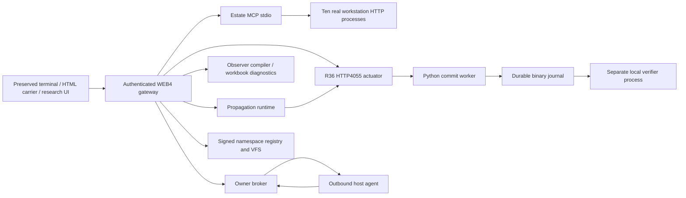

# WEB4 cloud runtime launch and recovery

## Purpose and implemented scope

Launch the actual owner-supplied KEX/BRAINK processes in the existing cloud workspace and connect the preserved browser carriers to them. Release 0.3.0 uses ten separately identified uploaded runtime sources and four custody-pinned owner control/HCI sources. Exact originals remain in the private deployment-queue repository and local Library; source custody and launch derivations are verified before starting. This local runtime is a delivered implementation, independent of the separate REV-002 four-archive production authority gates.

The prepared environment requires Python 3.12+, uv and Node (Node 24.19.0 was exercised). Chromium and Node's WebSocket API are needed only for browser verification. Reuse existing checkouts; do not create worktrees. No npm dependencies are needed to launch the supplied compiled Node entrypoints.

## Architecture and actual boundaries



The gateway serves all three original HTML carriers with a shared cloud-control panel; the terminal also receives cloud commands. Original browser-local filesystem/CPU models remain browser-local. Actual cloud state comes from authenticated backend readbacks, not browser counters. Workstation double-SHA cycles are local computation, not verified mining or external Stratum connectivity.

## Preparation and source derivation

```sh
cd /workspace/KEDDEH-SOVEREIGN-NAMESPACE-RUNTIME
UV_CACHE_DIR=/workspace/.cache/uv uv sync --frozen --python python
.venv/bin/python -m keddeh_namespace.web4_runtime prepare
```

Default library manifest: /workspace/library-files/KEDDEH/2026-10-07/manifest.json. Default runtime root: /workspace/braink-setup/web4-runtime. Use --library, --root and --port-offset for a distinct controlled environment. Preparation is atomic and refuses to replace existing nonempty roots. If the local Library is absent, `.venv/bin/python scripts/restore_web4_library.py` restores the exact originals from the private deployment queue using existing GitHub proxy access; this recovery was exercised and hash-verified. It pins original SHA/size, performs bounded safe extraction and records every derived package file hash.

Derivations retain v5.7 estate MCP and overlay the exact ten v6.1 workstation sources. V7.1 observer and V7.3 workbook modules are integrated separately. Incomplete newer MCP replacements are not silently substituted: their absent higher_order_compiler, capability_hardener, commitment_ring, tl2_persistence_verifier and viabtc_protocol imports remain recorded limitations. No uploaded apply script is run wholesale.

The R36 HTTP port/journal location becomes configurable; HTTP and network workers use separate journals. Broker handling is serialized, its ledger uses a cross-process lock, command publication is atomic, and result request/node/lease/state bindings are checked. Generated local credentials and signing keys live under private state/, not in repository files or process arguments.

## Launch, readiness and commands

```sh
bash scripts/start_web4_cloud.sh
.venv/bin/python -m keddeh_namespace.web4_runtime status
.venv/bin/python -m keddeh_namespace.web4_runtime restart --name node-19100
.venv/bin/python -m keddeh_namespace.web4_runtime stop
```

Default loopback ports: gateway 18087, network MCP 18086, R36 HTTP 4055, broker 18777, workstations 19100–19109. Existing unrelated listeners block launch; the controller never adopts or stops them. Start reports readiness only after all ten node readbacks and the current outbound-agent boot command complete. The start script reuses a healthy runtime; the explicit start operation enforces a single controller lock. Stop waits for owned-process cleanup before reporting completion.

Gateway routes: /terminal, /carrier and /research preserve the original UIs; /api/web4/status and /api/web4/generation require the private bearer token. /api/web4/control accepts bounded, allowlisted actions. The UI's Connect action or terminal's cloud auth accepts the token locally and retains it in tab memory only. Read the private state/token securely in the environment; never paste it into a repository, issue, command argument or chat.

Terminal commands: cloud status; cloud boot; cloud commit NODE NONCE TENANT; cloud restart node-PORT; cloud observer; cloud workbook; cloud propagate; cloud enact. Propagate computes state and seals the readback. Enact additionally clamps each state to [0,1], rounds to uint32 and commits through real R36 registers, with node IDs mapped to declared workstation ports. The R36 registers are Python-managed software state backed by durable journals, not external hardware registers. This explicit quantization is not a physical neural/circuit measurement. The full state and returned actor receipts are retained; external physical actuation is not claimed.

## Evidence and integrity

Runtime observations bind owner-source hashes, actual launch derivation hashes, runtime package version/code hashes and separate state/phase roots. Source manifests and signed generations are stored in the private runtime state registry. Floating-point readbacks use exact tagged float64 hexadecimal strings because the namespace canonical format excludes JSON floats. Independent production assessment remains pending; a separate process/key on the same host is local verification, not organizational independence.

```sh
.venv/bin/python -m unittest discover -s tests -v
.venv/bin/python scripts/verify_web4_runtime.py --output /workspace/braink-setup/web4-integration-evidence.json
node scripts/test_web4_browser.mjs --container-no-sandbox
python scripts/check_governance.py
```

The integration verification executes real commits/retries/restart/agent/mesh operations in its explicitly named local tenant. It terminates one owned workstation to verify automatic restart. It does not alter external DNS/registrar state. Browser verification uses actual Chromium tabs; --container-no-sandbox is needed only because this container's Chromium SUID helper is unavailable. No browser isolation claim follows from that test; ordinary environments should use the default browser sandbox.

69 tests passed in source and separately installed wheel during release validation. Live integration evidence and browser evidence are in docs/evidence/web4-*.json. They demonstrate observed local operation, not cloud publication or independent production deployment. The broader workbook inventory currently reports findings; retain them for remediation rather than rewriting old supplied receipts as new passing results.

## Supervision, limits and recovery

The controller owns subprocess handles/process groups and launches argv arrays without a shell. It automatically restarts failed workstation processes at most three times. Successful restart requires fresh health readback in verification; it does not imply recovery of arbitrary application state. Manual restart is limited to workstation, HTTP and network services. Estate MCP, broker and agent restarts require a controlled whole-runtime restart.

Actual per-process limits are core dumps disabled, 256 open descriptors, and 64 MiB maximum output-file size. Request/response/stdio limits and bounded retry/response queues apply. These are not memory quotas, CPU reservations, disk-volume quotas or separate failure domains. Local underlying services are loopback-only and trust the workspace OS principal; do not expose their unauthenticated original endpoints publicly. Public service operation requires suitable access control, TLS, isolation, quotas and target acceptance.

For a failure, preserve private logs, journals, trust, credentials, source manifest and namespace records; diagnose before changing them. Restart HTTP/network with their existing journal paths and verify deterministic receipt readback. If a multi-register actuation fails after a prefix commits, retain that prefix and reconcile through the journal; do not claim all-register atomicity. Re-admission/upgrades MUST use new prepared source locations and preserve prior state and custody. Failed atomic preparation does not replace an existing runtime. Public deployment and cloud snapshot publication are separately recorded operations.

## Change history

| Revision | Date | Change | Basis |
|---|---|---|---|
| 1.0 | 2026-10-07 | Implemented WEB4 cloud launch, actuation, browser bridges and functional recovery | Owner integration instruction; independent review pending |

## Repository families, VFS and frontage

Each repository carries `.keddeh/family.json`, its launcher and the qualified public wheel with process/action/configuration documentation. Nine families have isolated state and ports on one physical cloud host. Each family operates ten host workstations and three distinct recursive network domains with three owner workers per domain. These are software actuators and owner-governed bilateral execution, not physical energy generation.

Start the primary VFS repository family first, then the remaining repository launchers. The owner VFS_SERVER provides authenticated artifact admission, independent byte readback, observer receipts, durable event cursors and subscriptions. Each family caches package updates only after digest verification; promotion is explicit. Both private VFS repositories carry the complete private owner-source bundle. Public repositories carry the wheel rather than private raw uploads.

Recovery preserves root state, token files, domain mount state and signed history. Missing owned Docker containers are re-created from admitted configuration; existing foreign containers are rejected. Docker namespace isolation does not establish multi-host disaster recovery. Backoff limits repeated service restart attempts. Resource limits and one-host capacity require separate production sizing.

The keddeh.com family additionally serves 13 customer routes and stores consented registrations privately with durable idempotency and 90-day retention. Customer HTTP requests cannot invoke owner control actions. The integration candidate records the existing Site identity; native public publication is pending unavailable Sites source/publishing access. Git push is not a Site deployment receipt. Local DOM evidence and package qualification remain distinct from independent production assessment.
